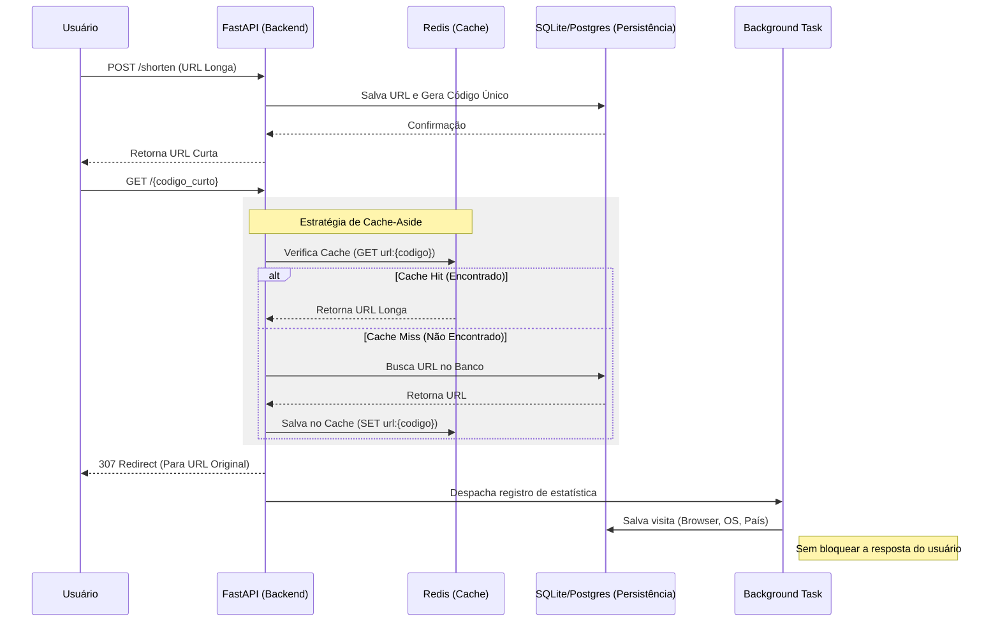

# 📘 Documentação do Projeto: Encurtador de URL Escalável

> **Este documento detalha a arquitetura, decisões técnicas e estrutura do sistema. Ideal para acompanhar o projeto em seu portfólio.**

---

## 🏗️ Visão Geral da Arquitetura

O sistema foi projetado com foco em **performance** e **escalabilidade horizontal**. A separação entre a camada de leitura (Redirecionamento) e a camada de escrita/análise (Estatísticas) permite que o sistema aguente altas cargas de tráfego.

### Diagrama de Fluxo de Dados

---

## 🧠 Decisões Técnicas

### 1. Por que FastAPI?
Escolhi o **FastAPI** por sua natureza assíncrona (`async/await`). Em um encurtador de URL, a latência é crítica. O FastAPI permite lidar com milhares de conexões simultâneas de redirecionamento sem bloquear a thread principal, superando frameworks tradicionais como Flask ou Django em cenários de I/O intensivo.

### 2. O Papel do Redis (Caching)
O banco de dados relacional (SQL) é o gargalo mais comum em sistemas de leitura intensiva.
- **Solução**: Implementei o Redis como camada de cache.
- **Resultado**: URLs acessadas frequentemente são servidas diretamente da memória RAM do Redis (latência de sub-milissegundos), protegendo o banco de dados de sobrecarga.

### 3. Background Tasks para Estatísticas
Registrar cada visita no banco de dados é uma operação de escrita "cara" que poderia deixar o redirecionamento lento.
- **Solução**: Usei `BackgroundTasks` do FastAPI.
- **Resultado**: O servidor responde "OK" e redireciona o usuário *imediatamente*. O registro da visita (parsear User-Agent, salvar no banco) acontece em segundo plano, sem que o usuário perceba qualquer demora.

---

## 💾 Modelagem de Dados

O banco de dados foi modelado para garantir integridade e permitir análises futuras.

### Tabela `URL`
Armazena os dados "core" do sistema.
- `key` (Indexado, Único): O código curto (ex: `Ab3dE`). Indexado para buscas O(1).
- `target_url`: O destino original.
- `expires_at`: Permite a funcionalidade de links temporários.

### Tabela `Visit`
Armazena cada evento de clique individualmente.
- **Benefício**: Permite agregações complexas no futuro (ex: "Cliques por hora", "Cliques por cidade").
- **Campos**: `browser`, `os`, `country`, `timestamp`.

---

## 🛡️ Segurança e Robustez

- **Validação de Dados**: Uso do **Pydantic** garante que apenas URLs válidas entrem no sistema.
- **Docker**: O ambiente é isolado em containers, garantindo que o código rode igual na minha máquina e no servidor de produção.
- **Testes Automatizados**: Cobertura de testes unitários e de integração garante que refatorações não quebrem funcionalidades existentes.

---

## 🔮 Melhorias Futuras (Roadmap)

Se este projeto fosse evoluir para um produto SaaS, os próximos passos seriam:
1.  **Rate Limiting**: Impedir abuso da API por um único IP.
2.  **Auth**: Contas de usuário para gerenciar seus próprios links.
3.  **Fila de Mensagens (RabbitMQ/Kafka)**: Substituir `BackgroundTasks` por uma fila real para garantir que nenhuma estatística seja perdida se o servidor reiniciar.
